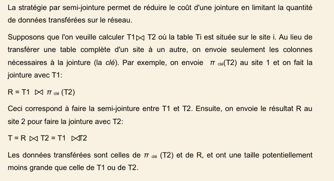

# BDD AVANCEE - 2020(2)

**1.a M.q si X->Y et X->Z alors X->Y,Z**

Soient X, Y et Z des attributs d'une relation. La proprietE d'union est déduite de la réflexivité et de l'augmentation dans les axiomes d'Armstrong:

Par réflexivité, tout groupe d'attributs se détermine lui même et détermine chacun de ses attributs:
```
Si X→Y et X→Z alors X→XX
```

Par augmentation, si un attribut X détermine un attribut Y, alors tout groupe composé de X enrichi avec d'autres attributs détermine un groupe composé de Y et enrichi des mêmes autres attributs:
```
Si X→Y alors XX→XY
Si X→Z alors XX→XZ 
Si XX→XY,XZ
Donc X->Y,Z (cqfd)
```

---

**1.b Application de la propriete a la relation MachineOutil**
- Soit la relation suivante:
`MachineOutil(noMachine, marque, debit)`

- Et la DF suivante:
`DF = {noMachine->marque, noMachine->debit}`

On sait que `noMachine` est une cle de la relation `MachineOutil`, d'apres la DF donnEe, cette cle determine les attributs non cle `marque` et `debit`, par la regle d'union, on obtient la nouvelle DF suivante:
```
Si noMachine->marque et noMachine->debit
Alors noMachine->marque, debit
```

---

**1.c L'interet pratique de cette propriete**

L'intérêt pratique de cette propriété est la `factoritation des plusieurs DF` à condition que chaque attribut non cle partage la même source

---

**2.a L'utilite de la normalisation d'une base de donnees**

La normalisation est un processus de décomposition d'une table universelle en plusieurs tables en évitant le problème d'incohérence et de redondance sans perdre d'information tout en préservant les DFs et qui permet de vérifier la robustesse de leur conception pour améliorer la modélisation

---

**2.b Cas de denormalisation d'une relation | inconvenients et necessitE eventuelle d'une denormalisation**

`Interet pratique de la denormalisation`

On applique la denormalisation d'une relation lorsque on a besoin d'améliorer les performances de la BD en implémentant les jointures plutôt qu'en les calculant. Autrement dit, un schéma doit être dénormalisé lorsque les performances de certaines recherches sont insuffisantes et que cette insuffisance à pour cause des jointures

`Inconvenients de la denormalisation`

La dénormalisation peut également avoir un effet néfaste sur les performances si on ne controle la redondance volontaire:

- **En mise à jour**
Les données redondantes devant être dupliquées plusieurs fois.

- **En contrôle supplémentaire**
Les moyens de contrôle ajoutés (triggers, niveaux applicatifs, etc.) peuvent être très coûteux.

- **En recherche ciblée**
Certaines recherches portant avant normalisation sur une "petite" table et portant après sur une "grande" table peuvent être moins performantes après qu'avant.

---

**2.c Contre-exemple de 2FN mais non 3FN**

---

**3.a Normalisation de la table VENTE, COMMANDE et PRODUIT (si necessaire)**

VENTE(NPRO, CLIENT, DATE, QUANTITE, ADRESSE, DELEGUE, REGION)
COMMANDE(NCOM, NCLI, NOM, DATE, NPRO, LIBELLE)
PRODUIT(NPRO, DATE_INTRO, IMPORTATEUR, AGREGATION)

`DF`
NCLI->CLIENT, ADRESSE, DELEGUE, REGION
NPRO, NCLI->DATE, QUANTITE
NCOM->NCLI, NPRO, NOM, DATE, LIBELLE
NPRO->DATE_INTRO, IMPORTATEUR, AGREGATION

`Normalisation`
CLIENT(NCLI, ADRESSE, DELEGUE, REGION)
VENTE(NPRO, NCLI, DATE, QUANTITE)
COMMANDE(NCOM, NCLI, NPRO, NOM, DATE, LIBELLE)
PRODUIT(NPRO, DATE_INTRO, IMPORTATEUR, AGREGATION)

---

**3.c Type de jointure pour avoir la liste des produits qui n'ont jamais ete vendus | explication**

---

**4.a Definition de la contrainte d'integritE**

Quel que soit le modèle de données (entité association, relationnel ou autre), il existe toujours des règles du monde réel qui ne peuvent pas être exprimées par les concepts du modèle. Certaines de ces règles restreignent les valeurs que peuvent prendre les données de la base. Elles sont appelées Contraintes d intégrité.

---

**4.b Differents types de contrainte d'integritE**

- **Contraintes de domaine** 
Qui restreignent l'ensemble des valeurs que peut prendre un attribut dans une table 
  
- **Contraintes d'integrite d'entite**
Qui precisent qu une table doit toujours avoir une cle primaire 
  
- **Contraintes d'integrite referentielle**
Qui precisent les conditions dans lesquelles peuvent etre ajoutEs ou supprimEs des enregistrements lorsqu il existe des associations entre tables par l'intermediaire de cles etrangeres
  
- **Contraintes d'integrite quelconque**: 
Qui permet de spécifier que lors de toute insertion (ou suppression ou modification) d'un tuple dans telle relation telle condition doit être satisfaite sinon telle action doit être entreprise automatiquement par le SGBD, comme par exemple refuser l'insertion ou envoyer un message d'alerte.

---

**4.c Exemple pour chaque type de contrainte d'integritE**

- **Contraintes de domaine**
Domaine de valeurs particulier d'un attribut: clause CHECK 

- **Contraintes d'integrite d entite**
Identifiant: clauses PRIMARY KEY et UNIQUE 
Attribut obligatoire: clause NOT NULL 

- **Contraintes d'integrite referentielle**
Clause FOREIGN KEY

- **contrainte d intégrité quelconque**
Clause TRIGGER

---

**5.a Differences entre BD repartie et BD parallele | Les Avantages d'une BD repartie par rapport a une architecture centralisEe**

`Differences`

- **BD parallèles**
Les données peuvent être réparties sur plusieurs disques d'un même site, et l'exécution des requêtes peut être parallélisée sur les différentes unités de traitement (CPU) du site.
 
- **BD réparties**
Les données sont diffusées et/ou dupliquées sur différents sites du réseau (ex: internet) qui disposent d'une certaine degré d'autonomie. Chaque site peut avoir une BD parallèle.

`Avantages`

- **Performance** 
En rapprochant les données des applications utilisant ces données (ex : stockant les comptes des clients montréalais dans un site localisé à Montréal), on peut réduire les coûts de transfert sur le réseau et, ainsi, augmenter la performance des requêtes sur ces données. 

- **Fiabilité**
En dupliquant certaines données importantes sur plusieurs sites, on minimise l’impact d’une panne sur un site. De même, en cas de panne, on peut rediriger le traitement d’une requête vers un autre site disponible. 

- **Extensibilité**
Si les besoins en espace de stockage et en puissance de traitement augmentent on peut facilement rajouter un nouveau nœud (site), sans avoir à remplacer le serveur (ex : approche Google).

---

**5.b Le principe de la strategie d'optimisation par semi-jointure**



---

**6. Precaution pour sauver et/ou resituer les donnees lors d'une catastrophe**

À mon avis, la meilleure façon de sauvegarder et de restaurer des données et d'éviter l'utilisation d'une architecture centralisée en adoptant une base de données distribuée et de dupliquer les données sensibles sur plusieurs bases de données des sites différents. De ce fait, le traitement d'une requete peut être redirigé vers un autre site disponible lors d'une catastrophe.