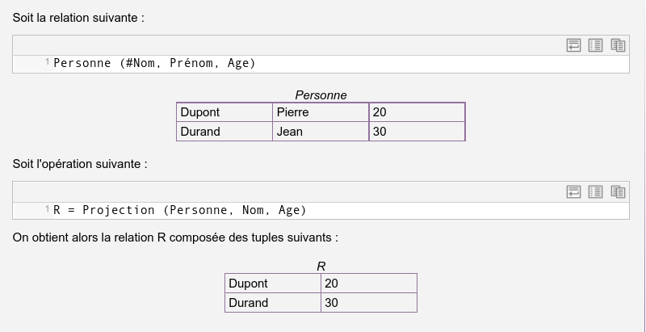
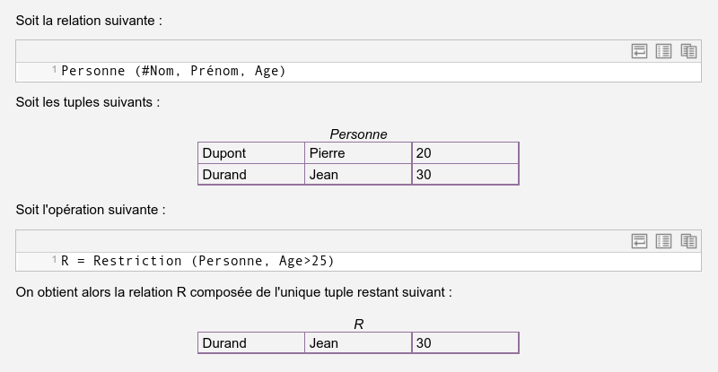
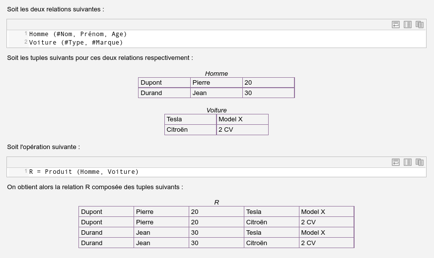
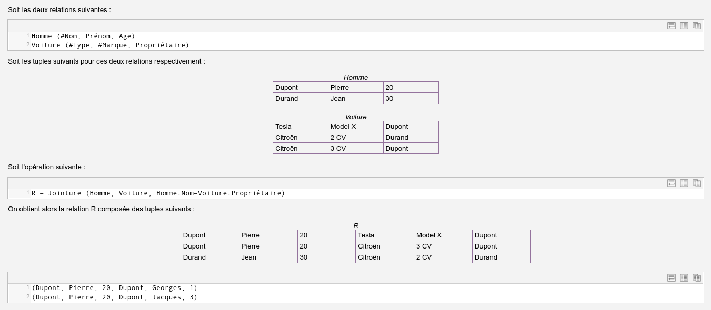
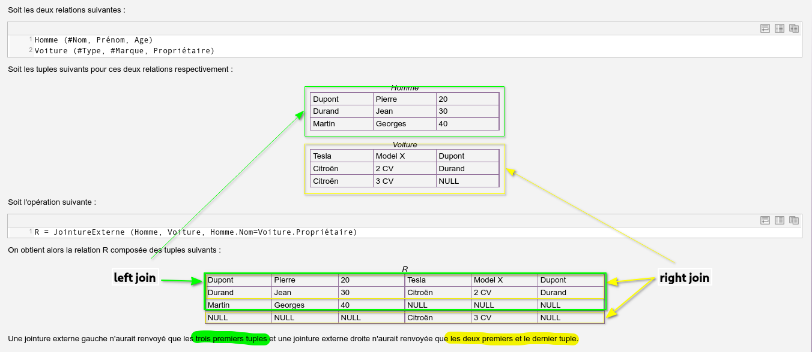

# ALGEBRE RELATIONNELLE

##### ref: https://stph.scenari-community.org/idl-bd/7/co/alg1_1.html


> **def**: La représentation d'information sous forme relationnelle est intéressante car les fondements mathématiques du relationnel, outre qu'ils permettent une modélisation logique simple et puissante, fournissent également un ensemble de concepts pour manipuler formellement l'information ainsi modélisée.
>
> Ainsi une algèbre relationnelle, sous forme d'un ensemble d'opérations formelles, permet d'exprimer des questions, ou requêtes, posées à une représentation relationnelle, sous forme d'expressions algébriques.

**L'algèbre relationnelle est composée par les cinq opérateurs de base et les trois opérateurs additionnels suivants :**

```markdown
** opérateurs de base **
- Union
- Différence
- Projection
- Restriction
- Produit cartésien

** opérateurs additionnels **
- intersection
- jointure
- division
```

---

#### `PROJECTION`

> **def**: La projection est une opération unaire (c'est à dire portant sur une seule relation). La projection de R1 sur une partie de ses attributs {A1, A2, ...} produit une relation R2 dont le schéma est restreint aux attributs mentionnés en opérande, comportant les mêmes tuples que R1, et dont les doublons sont éliminés.

```txt
Note: Après suppression d'une partie des attributs du schéma, la relation peut comporter des doublons. Étant donné que l'on ne pourrait plus identifier ces doublons les uns par rapport aux autres, la seule solution sensée est donc de considérer que deux doublons sont équivalents, et donc de n'en garder qu'un seul dans la relation résultante.
```
**exemple**


---

#### `RESTRICTION`

> **def**: La restriction est une opération unaire (c'est à dire portant sur une seule relation). La restriction de R1, étant donnée une condition C, produit une relation R2 de même schéma que R1 et dont les tuples sont les tuples de R1 vérifiant la condition C.

**exemple**


---

#### `Produit cartésien`

> **def**: Le produit cartésien est une opération binaire (c'est à dire portant sur deux relations). Le produit de R1 par R2 (équivalent au produit de R2 par R1) produit une relation R3 ayant pour schéma la juxtaposition de ceux des relations R1 et R2 et pour tuples l'ensemble des combinaisons possibles entre les tuples de R1 et ceux de R2.

```txt
Note: Le nombre de tuples résultant du produit de R1 par R2 est égal au nombre de tuples de R1 fois le nombre de tuples de R2.
```

```txt
Note: Le nombre de colonne du produit de R1 par R2 est égal au nombre de colonne de R1 plus le nombre de colonnes de R2.
```

**exemple**


---

#### `Jointure`

> **def**: La jointure est une opération binaire (c'est à dire portant sur deux relations). La jointure de R1 et R2, étant donné une condition C portant sur des attributs de R1 et de R2, de même domaine, produit une relation R3 ayant pour schéma la juxtaposition de ceux des relations R1 et R2 et pour tuples l'ensemble de ceux obtenus par concaténation des tuples de R1 et de R2, et qui vérifient la condition C.

**exemple**


- **Jointure naturelle**
> **def**: La jointure naturelle entre R1 et R2 est une jointure pour laquelle la condition est l'égalité entre les attributs de même nom de R1 et de R2. Il est donc inutile de spécifier la condition dans une jointure naturelle, elle reste toujours implicite.

**exemple**
Soit deux relations R1 (A, B, C) et R2 (A, D), l'opération Jointure(R1,R2,R1.A=R2.A) est équivalente à l'opération **JointureNaturelle(R1,R2)**.

```txt
Note: Pour appliquer une jointure naturelle, il faut que les deux relations opérandes aient au moins un attribut ayant le même nom en commun.
```

- **Jointure externe**
>**def**: La jointure externe entre R1 et R2 est une jointure qui produit une relation R3 à laquelle on ajoute les tuples de R1 et de R2 exclus par la jointure, en complétant avec des valeurs nulles pour les attributs de l'autre relation.

**exemple**
