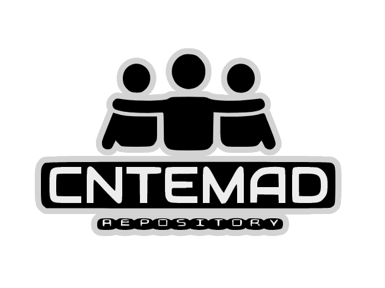

<h2 align="center">Hello world ! 👋</h2>

      

              

 

  

|[A propos](#a-propos-de-cntemad-repository)|[Fitsipika](#fitsipika)|[Toro-lalana](#toro-lalana)|[Mpandray anjara](#mpandray-anjara)|[Drive](#tahiry-google-drive)|[Tips&Tricks](#tips--tricks)|
|---|---|---|---|---|---|

 

# `A propos`
 

 
Bonjour, je vais vous expliquer brièvement ce projet <b> "CNTEMAD repository" </b>... C'est un projet dont on ne sait pas quand il sera achevé mais seulement nous, le(s) membre(s), le(s) participant(e.s) qui le font évoluer. Un projet inspiré d'une autre université que j'ai trouvé (par hasard) sur Github. Je tiens à préciser que ce projet s'adresse (principalement) à ceux qui font de l'informatique mais n'empêche pas d'autres domaines de nous rejoindre que vous soyez juridique, management, communication ou autre...

 
<b> Voici les objectifs que nous viserons (ensemble) avec ce projet et les bénéfices potentiels que nous pouvons obtenir: </b>
 
    
    ✅️  1. Le succès de chacun dans l'apprentissage qu'il fait à CNTEMAD (c'est l'objectif principal).
    
    ✅️  2. Le partage des connaissances.  
    
    ✅️  3. Pour que chacun sache ce qu'est le travail d'équipe.
    
    ✅️  4. Une opportunité pour quiconque d'entrer dans le monde de GIT.
    
    ✅️  5. En partant du partage habituel via facebook où il y a une restriction sur les "uploads" (format, taille de fichier), je pense qu'il sera plus facile de récupérer des fichiers sur une plateforme comme "Github".

    ✅️  6. Nous apprend à être plus discipliné.
    
    ✅️  7. Ce sera une archive pour nous et nos jeunes frères/sœurs qui vont étudier à CNTEMAD.
    
    ✅️  8. Pour éviter tout problème de déplacement.
    
    ✅️  9. Tout cela nous permet d'avoir le temps de nous concentrer d'avantage sur ce que nous faisons.
    
    ✅️  10. Lorsque nous avons un projet open source a collaborer avec des étudiants, nous pouvons le «centraliser» sur "CNTEMAD repository".
    
    ✅️  11. Partage de sujets, d'exercices, de documents, et tout ce qui est lié à nos études ...
    
 

👉️ Ce sont les raisons pour lesquelles j'ai commencé ce projet, lorsque vous êtes vraiment prêt(e) à nous rejoindre, <b> veillez completer les formulaires d'inscription ci-dessous </b> (nous essayons toujours de compléter les instructions étape par étape) en fonction de l'expérience de l'utilisateur du référentiel CNTEMAD...

 

 
<b> *** formulaire d'inscription (modele) *** </b> 

    📌️ Pseudo : Rakoto
    📌️ Niveau : L1 
    📌️ Filiaire : Info 
    📌️ Parcours : BDGL
    📌️ Github : https://github.com/Rakoto
    📌️ stack : HTML/CSS, Boostrap, Javascript, Python ...
    📌️ others: Competences/centre d'interet hafa raha misy (Musique, arts, etc...).

P/S: Tsara kokoa ilay `stack` raha ireo izay tena fampiasanao ihany no soratana eo @formulaire 

|[Guide d'inscription](https://github.com/RajaRakoto/cntemad-repository/blob/master/guide/gif/signup.gif)
|---|  

  

# `Fitsipika`

  

 

🛡️ Farafahakeliny ny mpikambana ato amin'ny "CNTEMAD repository" tokony mahay ny base'ny outil "Git", raha mbola tsy mahay dia hiangavina mba anaraka ireo torolalana eo ambany.

🛡️ Soroy ny zavatra tsy misy hifandraisany aminy "CNTEMAD repository".

🛡️ Fifampizarana no mamelona ity "projet" ity ka aoka isika mba hadray anjara araka izay vitan-tsika.

🛡️ Hamarino tsara ny `branche` misy anao alohan'ny hanaovanao zavatra. | [branche ?](https://git-scm.com/book/fr/v2/Les-branches-avec-Git-Les-branches-en-bref)

🛡️ Aza mandefa zavatra (fichier/repertoire) ao amin'ny `branche master`.

🛡️ Tsy azo atao ny mandefa `video`, ekena ny `fichiers` rehetra ankoatra izay, tsara kokoa raha compressE ho an'ireo fichier >= 50Mo, raha gros fichier (>=200Mo) dia mapiasa `service de stockage` sahala amin `google drive` ary ilay lien an'ilay fichier no alefa ato amin "CNTEMAD repository".

🛡️ Ny `nom de dossier & fichier` rehetra dia tsy tokony hisy `caracteres speciaux`, tsara kokoa raha `miniscule` daholo ary soloina `underscore "_"` na `tiret "-"` ny espace.

🛡️ Ilain'ny mpikambana rehetra ny `commentaire` ao @kaody nosoratanao mba hanamorana ny famakiana azy (commentez intelligemment).

🛡️ Hajao ny `Style d'indentation de code`, ataovy mirindra sy mazava tsara | [style d'indentation ?](https://fr.wikipedia.org/wiki/Style_d'indentation)

🛡️ Hajao hatrany ny `convention de commit` fampiasa, ataovy fohy nefa mazava azon'ny rehetra ny "commit" ataonao, fadio ny caractere speciaux | [commit ?](https://fr.wikipedia.org/wiki/Commit)

🛡️ `Nom de variable` mazava tsara, ary manaraka ny fomba fanoratana `camelCase` | [camelCase ?](https://fr.wikipedia.org/wiki/Camel_case)

🛡️ Mapiasa `TODO list` mba hampilamina ny organisation/priorisation des tâches ny zavatra ho atao.

 

<b> *** Ireto misy principe tsara adopte-na rehefa mi-code *** </b> 

    📜️ KISS: Keep It Simple, Stupid!
    La simplicité est la sophistication suprême | un code simple est plus lisible et plus facile à maintenir.

    📜️ DRY: Don’t repeat yourself
    Si la même portion de code se retrouve deux fois ou plus dans un script, on en fait une fonction. Si la même portion de code se retrouve deux fois ou plus dans une classe, on en fait une méthode.

    📜️ YAGNI: You aren’t gonna need it
    Rien ne sert de coder une méthode qui n’a pas d’implémentation ou d’utilité immédiate.

    📜️ Don’t be shy, ask!
    Il n’y a pas de honte à demander de l’aide, surtout avant d’attaquer une nouvelle fonctionnalité.

    📜️ Erik Buck: "write less code" ou "Écrire moins de code" pour rendre une source plus simple et plus facile à maintenir. 

    📜️ Obie Fernandez: toujours prendre le temps de réfléchir quand on a une erreur avant de rajouter du code supplémentaire. 

    📜️ Danny Kalev: il faut lire des livres, lire des magazines, apprendre encore et toujours de nouvelles techniques. Il conclut avec cette phrase : "read much more than you write" ou "Lisez plus que vous ne codez". 

    📜️ Eric Lippert: pour devenir meilleur, participer sur des forums ou des groupes de discussions en aidant ceux qui ont des questions, si vous avez la réponse, dites là, si vous ne l'avez pas, rechercher sa réponse sur Internet. 

    📜️ Mark Summerfield: rendre le code plus facile à comprendre et donc à maintenir. Le deuxième : écrire des tests unitaires pour son code avant de l'intégrer au projet. 

    📜️ Bill Wagner: d'abord rendre son code fonctionnel avant de vouloir l'améliorer ! Ça peut paraitre stupide mais il faut toujours garder cela en tête !

  

# `Toro-lalana`

  

 

|[Creer un compte Github](https://github.com/join?ref_cta=Sign+up&ref_loc=header+logged+out&ref_page=%2F&source=header-home)
|---|

Toro-lalana ho an'ireo vaovao eto amin'ny `Github`...

> [[Tutoriel sur le concept de git pour debutant - video 1h15 version Malagasy](https://fb.watch/5DM7FKnt_q/)]

> [[Gérez du code avec Git et GitHub - OpenClassrooms](https://openclassrooms.com/fr/courses/7162856-gerez-du-code-avec-git-et-github)]

Ity indray natokana ho an'ireo efa mahazo tsara ny concept ny `Git` sy ireo hanao contribution ato amin'ny "CNTEMAD repository" ...

> [[gitvers-tool](https://github.com/RajaRakoto/gitvers-tool-guide)]

Rehefa manao clone ny "CNTEMAD repository"

> Tapeo amin terminal/console ity commande ity: `$ git clone --depth 1 https://github.com/RajaRakoto/cntemad-repository`

 

Outil de versioning (`interface graphique | cli | script`), samy mampiasa `GIT` avokoa ireo:

| Outil            | Plateforme          | Download                                                  | Tuto                                                       | Github
|:-----------------|:--------------------|:----------------------------------------------------------|:-----------------------------------------------------------|:------------------------
| **Sourcetree**   | Windows             |[download ⬇](https://www.sourcetreeapp.com/)              |[tuto 🎬️](https://grafikart.fr/tutoriels/source-tree-592)   |- 
| **Gitbash**      | Windows - GNU/Linux |[download ⬇](https://git-scm.com/downloads)               |-                                                           |-
| **Gitkraken**    | Windows - GNU/Linux |[download ⬇](https://www.gitkraken.com/download)          |[tuto 🎬️](https://grafikart.fr/tutoriels/gitkraken-749)     |-
| **UNGIT**        | GNU/Linux           |[download ⬇](https://github.com/FredrikNoren/ungit)       |[tuto 🎬️](https://grafikart.fr/tutoriels/ungit-437)         |[github 🔗](https://github.com/FredrikNoren/ungit) 
| **gitvers-tool** | GNU/Linux           |[download ⬇](https://github.com/RajaRakoto/gitvers-tool)  |-                                                           |[github 🔗](https://github.com/RajaRakoto/gitvers-tool-guide)

  

# `Mpandray anjara`

  

 

Ato amin'ity section ity no haitantsika ireo mpikambana rehetra ato amin'ny **CNTEMAD repository**.

| Pseudo            |Role          | Filiaire | Niveau | Parcours | Github  | Skill(s)
|:------------------|:--------------|:---------|:-------|:---------|:--------|:--------------------------------------------------------------------------------------------------------------
| ♂️  **Mendrika**       |       -       |  Info    |L3      |   BDGL   |[Mendrika](https://github.com/Mendrika)  |stack: `HTML` `C` other: `Psychologie`
| ♂️  **Rivo**       |       -       |  Info    |L2      |   BDGL   |[Rivo](https://github.com/Rivo)  |stack: `HTML` `CSS` `Bootstrap` `Javascript` `Jquery` `PHP` `Python` `Java` `C` `Wordpress` others: `Anglais`
| ♂️  **Sarobidy**       |       -       |  Info    |L2      |   -   |[Sarobidy](https://github.com/Sarobidy)  |stack: `HTML` `CSS` `Visual basic` `Javascript` `C` 
| ♀️ **Woutnak**       |       -       |  Info    |L3      |   BDGL   |[Woutnak](https://github.com/Woutnak)  |stack: `HTML` `CSS` `Bootstrap` `Javascript` other: `Management` 
| ♂️ **Moratiana**       |       -       |  Info    |L1      |   BDGL   |[Moratiana](https://github.com/Moratiana)  |stack: `HTML` `CSS` `Bootstrap` other: `Reseau` 
| ♂️ **Brillant**       |       -       |  Info    |L3      |   BDGL   |[Bri11ant](https://github.com/Bri11ant)  |stack: `Python` `Javascript` `Angular` `Ionic` `PHP` `Java` other: `Infographiste` `designer` 
| ♂️ **Toky**       |       -       |  Info    |M2      |   BDGL   |[Gituxmanjaka](https://github.com/gituxmanjaka)  |stack: `HTML` `CSS` `Bootstrap` `Javascript` `Typescript` `Python` `Java` 
| ♂️ **Stany**       |       -       |  Info    |L3      |   BDGL   |[Stany Nilaina](https://github.com/StanyNilaina)  |stack: `Javascript` `Angular` `Ionic`
| ♂️ **Xoder**       |       -       |  Info    |L1      |   BDGL   |[Mr xoder](https://github.com/­mrxoder)  |stack: `HTML` `CSS` `Javascipt` `PHP` `Python`
| ♂️ **a2d**         |       -       |  Info    |L1      |   BDGL   |[Annael007](https://github.com/Annael007)         |stack: `HTML` `Python` `Java` `C` `VBS` other: `electro` `piano` `FLstudio`
| ♀️  **Fahendrena** |       -       |  Info    |L3      |    -     |[Fahendrena](https://github.com/Fahendrena)           |stack: `HTML` `CSS` `Javascript` `PHP` `Python`
| ♂️  **Wenceslas-Angelo** |       -       |  Info    |L1      |    BDGL     |[Angelo](https://github.com/Wenceslas-Angelo)           |stack: `HTML` `CSS` `Javascript` `Python`
| ♂️ **ChristianoDc7**        |-  |  Info    |L3      |   BDGL   |[ChristianoDc7](https://github.com/­ChristianoDc7)|stack: `HTML` `CSS` `Bootstrap` `Javascript` `PHP` `Python` `C`
| ♀️ **Naingo**      |       -       |  Info    |L2      |   BDGL     |[Fanaingo](https://github.com/Fanaingo)               |stack: `HTML` `CSS` `Javascript` `C` `PHP` `Bootstrap`
| ♂️ **Raja**        |`ADMIN` |  Info    |L3      |   BDGL   |[Raja Rakotonirina](https://github.com/RajaRakoto)|stack: `HTML` `CSS` `SASS` `Python` `Javascript` `Bash` `Bootstrap` `SemanticUI` other: `Photoshop` `Illustrator`

  

# `Tahiry "Google drive"`

  

 

|[Creer un compte Gmail](https://accounts.google.com/signup/v2/webcreateaccount?flowName=GlifWebSignIn&flowEntry=SignUp)|[Google DRIVE](https://drive.google.com/)|
|---|---|

`Google drive` ho an'izay mbola tsy mahalala dia `service de stockage en ligne (cloud)` iray an'ny Google. Inona no hifandraisany amin'ity projet ity ? tsara fantantsika fa misy fetrany ny zavatra azontsika tehirizina ato @github, eo @ `500Mo` eo no nomena ny `depot` iray ka noho izany no antony hampiasana ity service ity. `Google drive` dia manana "capacite de stockage" hatramin'ny `15Go` isakin'ny compte iray.

 

 <b> 🄽🅈 🄵🄾🄼🄱🄰 🄵🄰🄼🄿🄸🄰🅂🄰🄽🄰 🄰🅉🅈 (misy dingana 5) </b>

    1. Mamorona `compte google (gmail)` ary tonga dia omena anao maimaim-poana avy hatrany io `15go` io vao vita izay. 
    
    2. Rehefa connectE amin'ilay compte isika dia miditra ao amin'ny [Google DRIVE](https://drive.google.com/).

    3. Rehefa ao ianreo dia mahita `interface "Mon drive"` sahala amin'ireny "gestionnaire de fichier" ny "telephone" na "ordinateur" anareo ireny: Ao ianareo afaka manao `importation/exportation` fichier(s), `creer/supprimer dossier/fichier(s)`, miditra amin'nireo karazana `applications google` hafa (google docs[mitovy @word], google sheets[mitovy @excel], google slides[mitovy @powerpoint], ary mbola misy maro samihafa ...). 

    4. Ireto avy ary ny atao rehefa hampiditra fichier ao ianareo:
        
        * Miditra ao @ app [Google DRIVE](https://drive.google.com/) ianareo.
        
        * Click droite > Importer des fichiers.
        
        * Safidinareo ilay fichier ho zarainareo (tsara koakoa raha `compressE` ilay izy vao manao importation ianareo - voir section [Tips & Tricks])

        * Rehefa vita ny importation dia stockE zay ilay donnees, click droite eo @ilay fichier ary `Obtenir le lien`, dia afaka mizara azy @alalan'ny "LIEN PUBLIC" ny Google drive ianareo. Manana choix roa ianareo @fomba fizarana azy:
            
            1. partage "LimitE": izany hoe izay olona nomenareo autorisation ihany no afaka maka azy.
            2. partage "Publique": izay olona rehetra mahita ilay LIEN nomenareo ka miditra ao (ity no mahaliana antsika).

        * Rehefa vita ny safidy ny mode de partage dia tsindrio ny `copier le lien` ary raha tianareo ho eto @lisitra izany (ho zarainareo en public) dia miresaka @Admin na moderateur (izay hitanareo eo @Mpandray anjara) na alefanareo @adresse e-mail|facebook (@farany ambany ny pejy) dia verifiE ny admin/moderateur ary integrE-ny @CNTEMAD repository avy eo.

 

 <b> 🄸🅁🄴🄾 🅃🄰🄷🄸🅁🅈 🄰🄾 @🄶🄾🄾🄶🄻🄴 🄳🅁🄸🅅🄴  </b> 

__________________________________________________________________________________________________________________

**W3SCHOOL** offline | size: **372Mo** | added by ♂️ **Raja**                                         

|[download ⬇](https://drive.google.com/file/u/5/d/1bYFucI7qihaeLGvCpLhs7G8ZJclfFGxr/view?usp=sharing)|[demo 💻️](https://github.com/RajaRakoto/cntemad-repository/blob/master/guide/demo/w3school_demo.gif)|
|---|---|

    Site web (offline) fianarana ireo tehno web isankarazany
__________________________________________________________________________________________________________________

  

# `Tips & Tricks`

  

Ho itantsika ato amin'ny section `Tips & Tricks` avokoa ireo karazana atuces kely izay mety ilain'ny rehetra amin'ny fampiasana ny <b>"CNTEMAD repository"</b>, tsindrio fotsiny ilay [💡️] izay eo anilan'ilay theme tianao fantarina.

 

__________________________________________________________________________________________________________________

**Aide memoire git** [[💡️](https://github.com/RajaRakoto/cntemad-repository/blob/master/guide/pdf/github-git-cheat-sheet.pdf)]

    Ato daholo ny commande de base ny GIT, tsara raha manao test en local rehefa manandrana commande...
__________________________________________________________________________________________________________________

**Ny convention de commit** [[💡️](https://github.com/RajaRakoto/cntemad-repository/blob/master/guide/txt/commit-template)]

    Tsara foana isika rehefa manao "commit" dia manaraka convention mba ho mora amin'ny rehetra ny mamaky azy aveo.
    Mety misy "manipulation specifique" nataonao ka tsy hitanao ao amin'ny "modele de commit" ilay "type de commit" dia tsara raha manaraka ilay structure
    <type> (<specify>): <topic> | <description> dia efa mety. Izany hoe foroninao ilay <type> ...
__________________________________________________________________________________________________________________

**Ny fomba fanaovana compression de donnees** [[💡️](https://www.malekal.com/7zip-compresser-decompresser-fichiers-zip-rar-7z-iso/)]

    Ny compression de donnees dia miaro azy amin'ny "programme malveillant" sy manampy @resaka vitesse de "upload|download".

    Ho an'ny mpampiasa Windows ilay lien eo ambony, fa raha sous GNU/Linux dia sahala amin'izao no fanaovana compression/decompression:

        [compression]:--->$ tar cvfz <ilay sortie: <mon-fichier>.tar.gz> <ilay entrer: mon-fichier>
        [ohatra]:-------->$ tar cvfz exercices-maths.tar.gz exercices-maths
        [decompression]:->$ tar xvf exercices-maths.tar.gz
__________________________________________________________________________________________________________________

<i>
📢️ P/S: Raha misy soso-kevitra na fanatsarana momba an'ny "CNTEMAD repository" tianao atao dia alefaso mail na facebook @ lien eo ambany
</i>

  

 

 

<h1>ℳ𝒾𝓇𝒶𝓇𝓎 𝒻𝒶𝒽ℴ𝓂𝒷𝒾𝒶𝓏𝒶𝓃𝒶 𝒽ℴ 𝒶𝓃𝓉𝓈𝒾𝓀𝒶 𝓇ℯ𝒽ℯ𝓉𝓇𝒶 !</h1>

